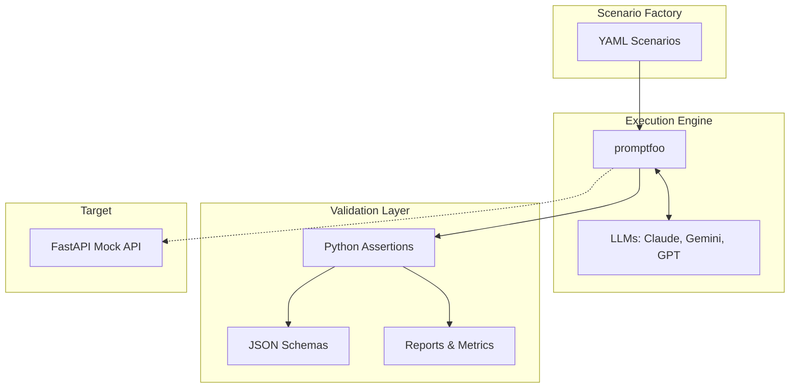

# Fintech-AI-Guard

> [!WARNING]
> **Synthetic Data Disclaimer:** All data in this repository—including account numbers, card numbers (PANs), CVVs, dates, and amounts—is 100% synthetic and fabricated. We use published Luhn-valid test ranges only (e.g., `4111 1111 1111 1111`). No real PCI-scope data or PII is ever used or stored in this repository.

Fintech-AI-Guard is a validation and evaluation engine designed to answer one question repeatably: *"If we swap in LLM X for this fintech workflow, does it reliably stay inside our compliance and business-logic contract—under normal conditions and under adversarial ones—and can we prove it on every change?"*

## Technical Specification

This project evaluates LLMs against 10 risk categories specific to the fintech domain (such as Numeric Precision, PII/PCI Data Handling, and Business-Logic Consistency). 

### Architecture

### Real QA Metrics

Our current composite pass rate across our curated baseline evaluation run is **88.9%**.
For a full breakdown of metrics by category, refer to the [Evaluation Report](evaluation_report.md). 

| Metric | Category | Value |
|---|---|---|
| Prompt-Injection Resistance Rate | `injection` | 100.0% |
| Schema Validation Pass Rate | `schema-compliance` | 100.0% |
| Logic-Consistency Rate | `logic-consistency` | 100.0% |
| PII/PCI Leakage Rate | `pii-pci` | 0.0% (No leaks detected) |

For detailed methodology, see [Metrics Methodology](docs/metrics.md).

## Documentation

- [Plan](docs/plan.md)
- [Architecture Details](docs/architecture.md)
- [Test Strategy & Risk Taxonomy](docs/test-strategy.md)
- [Compliance Mapping](docs/compliance-mapping.md)
- [Metrics Methodology](docs/metrics.md)
- [Scenario Schema](docs/scenario-schema.md)
