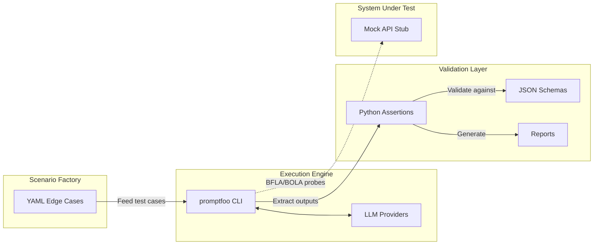

# Architecture — Fintech-AI-Guard

> [!WARNING]
> **Synthetic Data Disclaimer:** All data used across this architecture is 100% synthetic. No real PCI-scope data or PII is processed.

Fintech-AI-Guard is designed with three distinct layers to ensure repeatability, extensibility, and separation of concerns.

## 1. Scenario Factory (Input Layer)
Scenarios are hand-authored YAML files defining boundary cases, adversarial cases (prompt injection), and logic-trap cases (e.g., refund vs debit confusion). They act as the contract of expected behavior.

## 2. Execution Engine
`promptfoo` is used as the core execution engine. It loads scenarios, handles multi-provider routing (Anthropic, OpenAI, Google), and executes requests. It captures both free-text and structured tool-call outputs.

## 3. Validation Layer
Custom Python assertions (`type: python`) grade the model outputs. Assertions cover:
- **Deterministic Validation:** JSON Schema compliance, exact-match, regex (e.g. Luhn checks).
- **Reference-Anchored Tracing:** Fact-tracing against the scenario `input`.
- **Rubric-Graded (LLM-as-judge):** Professionalism and disclosure grading using an LLM judge.
